# Pipeline Map

_Auto-generated by `map_pipeline.py` on 2026-05-31 19:22:33. Re-run any time to refresh._

## Flow

```mermaid
flowchart TD
    D[fetch_all_data.py<br/>SEC/FRED/FINRA/CFTC...] -.optional overlay.-> S7
    S1["1 1&#95;&#95;TickerDownloader.py"]
    S2["2 2&#95;&#95;PriceDownloader.py"]
    S3["3 3&#95;&#95;AlphaSensitivity.py"]
    S4["4 4&#95;&#95;Predictor.py"]
    S5["5 5&#95;&#95;NightlyBackTester.py"]
    S7["7 7&#95;&#95;MacroFilter.py"]
    S9["9 9&#95;SuperFastBroker.py"]
    S1 --> S2 --> S3 --> S4 --> S5
    S5 --> S7 --> S9
```

## Stages

### Stage 1 — `1__TickerDownloader.py`
- **Run:** `python 1__TickerDownloader.py --ImmediateDownload`
- **Role:** Pull the current SEC ticker/CIK universe of tradable securities.
- **Inputs:** SEC EDGAR (network)
- **Outputs:**
    - `Data/TickerCikData` — 7 file(s), 1.0MB, newest 2026-05-07 10:44 (585h ago)

### Stage 2 — `2__PriceDownloader.py`
- **Run:** `python 2__PriceDownloader.py --RefreshMode`
- **Role:** Download / refresh daily OHLCV price history per ticker (yfinance).
- **Inputs:** `Data/TickerCikData`, Yahoo Finance (network)
- **Outputs:**
    - `Data/PriceData` — 4250 file(s), 109.5MB, newest 2026-05-29 22:01 (45h ago)

### Stage 3 — `3__AlphaSensitivity.py`
- **Run:** `python 3__AlphaSensitivity.py --runpercent 100`
- **Role:** Feature engineering -- technical / synthetic / matrix-power indicators.
- **Inputs:** `Data/PriceData`
- **Outputs:**
    - `Data/ProcessedData` — 4250 file(s), 4.7GB, newest 2026-05-31 01:28 (18h ago)

### Stage 4 — `4__Predictor.py`
- **Run:** `python 4__Predictor.py --predict_only  (or --runpercent 75 to retrain)`
- **Role:** Train + calibrate the XGBoost classifier and score every ticker.
- **Inputs:** `Data/ProcessedData`
- **Outputs:**
    - `Data/SimpleModel` — 17 file(s), 9.3MB, newest 2026-05-19 01:49 (306h ago)
    - `Data/RFpredictions` — 4250 file(s), 138.2MB, newest 2026-05-31 18:47 (1h ago)

### Stage 5 — `5__NightlyBackTester.py`
- **Run:** `python 5__NightlyBackTester.py --force`
- **Role:** Backtest the strategy and emit the day's buy signals + trade history.
- **Inputs:** `Data/RFpredictions`, `Data/PriceData`
- **Outputs:**
    - `_Buy_Signals.parquet` — 1 file(s), 6.6KB, newest 2026-05-31 19:22 (0h ago)
    - `trade_history.parquet` — 1 file(s), 76.3KB, newest 2026-05-31 03:11 (16h ago)
    - `Data/0__signals.parquet` — 1 file(s), 19.4KB, newest 2026-05-31 19:22 (0h ago)

### Stage 7 — `7__MacroFilter.py`
- **Run:** `python 7__MacroFilter.py (optional macro overlay)`
- **Role:** LLM/macro overlay that can veto signals (needs Claud-API-KEY.txt).
- **Inputs:** `Data/0__signals.parquet`, `Data/FRED`, Anthropic API
- **Outputs:**
    - `Data/0__signals.parquet` — 1 file(s), 19.4KB, newest 2026-05-31 19:22 (0h ago)

### Stage 9 — `9_SuperFastBroker.py`
- **Run:** `python 9_SuperFastBroker.py (live)`
- **Role:** Execute the filtered signals live via Interactive Brokers (IBKR).
- **Inputs:** _Buy_Signals.parquet, `IBKR TWS/Gateway`
- **Outputs:**
    - `_Live_trades.parquet` — 1 file(s), 7.1KB, newest 2025-11-24 07:31 (4524h ago)

## Independent data layer

- **Run:** `python fetch_all_data.py`
- **Role:** Idempotent pull of SEC / FRED / FINRA / CFTC / Treasury / KenFrench / Shiller data.
- **Outputs:**
    - `Data/SEC` — 93798 file(s), 32.0GB, newest 2026-05-29 01:15 (66h ago)
    - `Data/FRED` — 22 file(s), 2.4MB, newest 2026-05-28 22:00 (69h ago)
    - `Data/FINRA` — 17419 file(s), 2.5GB, newest 2026-05-28 20:30 (71h ago)
    - `Data/CFTC_COT` — 77 file(s), 224.9MB, newest 2026-05-28 21:03 (70h ago)
    - `Data/Treasury` — 37 file(s), 578.8KB, newest 2026-05-28 20:09 (71h ago)
    - `Data/KenFrench` — 30 file(s), 93.0MB, newest 2026-05-28 20:03 (71h ago)
    - `Data/Shiller` — 2 file(s), 1.8MB, newest 2026-05-28 20:09 (71h ago)
    - `Data/Wikipedia` — empty
    - `Data/UnifiedPanel` — 3 file(s), 246.0MB, newest 2026-05-29 07:13 (60h ago)

## Repo layout

- `auxiliary/` — `0__*` pre-pipeline EDA / analysis scripts (not in the nightly run).
- `showcase/` — portfolio HTML/PDF artifacts.
- `.claude/docs/` — session notes, handoffs, replication reports.
- `fetchers/` — per-source data fetchers used by `fetch_all_data.py`.
- `setup.ps1` / `requirements.txt` — environment bootstrap.
- `run_pipeline.py` — freshness-aware runner for stages 2–5.
